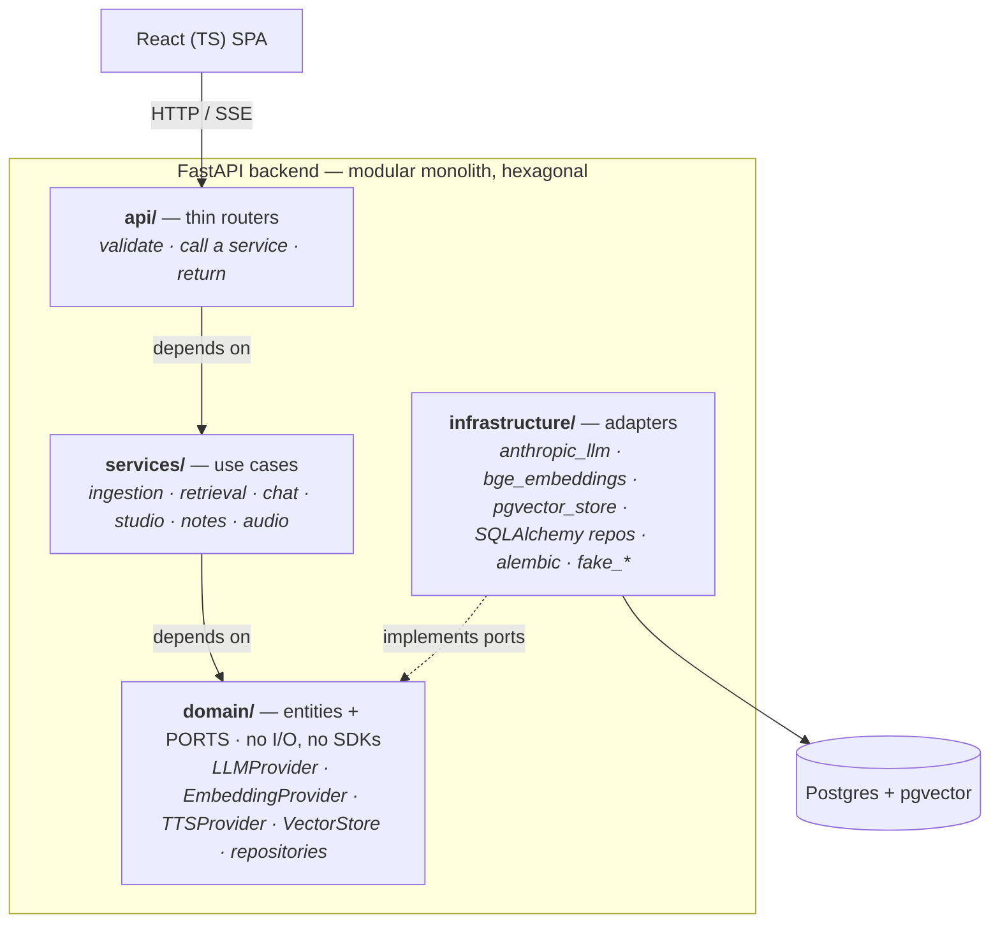

# CloneLM — a faithfulness-first NotebookLM clone

CloneLM is a [NotebookLM](https://notebooklm.google.com)-style research assistant.
You create a **notebook**, add **sources** (PDF · text · Markdown · URL · pasted
text), and work with them: **grounded chat with clickable citations**, one-click
**Studio artifacts** (summary · FAQ · study guide · briefing · timeline), saved
**notes**, and a stretch **audio overview**. Manage several notebooks from a
**library** switcher, delete individual sources, and switch the LLM between
**Claude** and a **local open-source model (Ollama)** in **Einstellungen** — at
runtime, no restart or code change. The UI is in German.

CloneLM runs in **two builds**, chosen by a single `DEPLOYED` env flag:
- **Localhost** (default, `DEPLOYED=false`): single-user, no login, local **bge-m3**
  embeddings, optional local Ollama LLM — the experience above.
- **Hosted / deployed** (`DEPLOYED=true`): a **multi-user** app with accounts,
  **per-user API keys** (each user brings their own Anthropic + Voyage keys, stored
  encrypted), **per-user data isolation**, and **Voyage AI** embeddings (no GPU).
  Ships as two services on **Railway** — see [RAILWAY.md](RAILWAY.md).

> ### North star — faithfulness over everything
> Every answer and artifact is produced **only** from retrieved chunks of the
> active notebook's sources (RAG), carries a **citation** you can click to see the
> exact supporting passage, and the system **refuses** when the sources don't
> support an answer — it never falls back on the model's world knowledge.
> Faithfulness here is **architectural** (RAG + mandatory citations + refusal),
> not a function of model size. See [CLAUDE.md](CLAUDE.md) for the hard invariants
> and [PLAN.md](PLAN.md) for the phase-by-phase build log.

It is demonstrably faithful — proven two ways:
- **Offline, in CI:** `backend/tests/test_faithfulness_eval.py` (deterministic, no key).
- **Live, real providers:** `backend/scripts/faithfulness_demo.py` ingests two
  sample sources and checks that supported questions are answered+cited while
  unsupported ones are refused.

---

## Architecture — modular monolith, hexagonal (ports & adapters)



**Dependency rule (enforced):** dependencies point inward.
`api → services → domain (ports)`; `infrastructure` implements those ports.
`services/` import **only** `domain/ports` — never `infrastructure/`, never a
vendor SDK. The composition root (`config.py` + `api/deps.py`) is the *only* place
that binds a port to a concrete adapter, chosen from env config.

**Pluggable providers** (swap = config change, not code change):

| Port | Default adapter | Alternatives |
|---|---|---|
| `LLMProvider` | Anthropic **Claude Haiku 4.5** (chat); **Sonnet 4.6** for Studio/Audio synthesis | **Ollama** (local open-source, e.g. Llama 3.1 / Qwen) — selectable at runtime in `Einstellungen`; `fake` (deterministic, offline); Sonnet/others by config |
| `EmbeddingProvider` | **bge-m3**, run locally (1024-dim, strong multilingual incl. German) | **Voyage AI** `voyage-3.5` (hosted, 1024-dim — used in the deployed build, no GPU); `fake` (offline) |
| `TTSProvider` | **Piper** local neural TTS (two German voices for the two-host Audio Overview, run offline) | `fake` (valid silent WAV); a SaaS TTS behind the same port |
| `VectorStore` | pgvector cosine KNN, **notebook-scoped** | — |

No vendor SDK is imported outside its adapter. With `LLM_PROVIDER=fake` /
`EMBEDDING_PROVIDER=fake` the **entire app and test suite run with no API key and
no model download**.

### The faithfulness loop (shared by chat and Studio)
`question → retrieve top-k chunks (this notebook only) → numbered grounding prompt
with strict "only use sources / cite / refuse" rules → LLM structured output
(answer + per-claim citation markers) → map markers back to source chunks + char
spans → refuse if retrieval is empty/weak or the answer has no usable citations`.
This lives once in `services/chat/grounding.py` (`GroundedGenerator`) and is reused
by Studio and Audio.

### Data model
`notebook · source · chunk(embedding vector, char offsets, page) · conversation ·
message · citation(message|studio, denormalized source span) · note ·
studio_output · audio_overview`. The core schema is one Alembic migration
(`…/migrations/versions/0001_initial.py`); sources stamp `embedding_model` /
`chunk_strategy` so a future re-index can migrate cleanly. The deployed build adds
`app_user` + a `notebook.user_id` owner FK in migration `0002` (accounts +
per-user data isolation; passwords argon2-hashed, API keys Fernet-encrypted).

---

## Quick start

Prerequisites: **Docker**, [**uv**](https://docs.astral.sh/uv/), **Node 20+**.

```bash
# 1. Config — copy the template and (optionally) add your Anthropic key
cp .env.example backend/.env        # set ANTHROPIC_API_KEY for real chat/Studio

# 2. Database (Postgres + pgvector)
docker compose up -d

# 3. Backend
cd backend
uv sync --extra embeddings --extra audio   # core deps + local bge-m3 (torch) +
                                    #   Piper neural TTS. Omit --extra embeddings to run
                                    #   EMBEDDING_PROVIDER=fake; omit --extra audio to run
                                    #   TTS_PROVIDER=fake (Audio Overview becomes silent).
uv run --extra audio python scripts/download_piper_voices.py   # one-time voice download
                                    #   (else they auto-download on the first audio request)
uv run alembic upgrade head         # create the schema
uv run uvicorn app.main:app --reload
#   → http://localhost:8000/health   ·   OpenAPI/docs at /docs

# 4. Frontend
cd ../frontend
npm install
npm run dev                         # → http://localhost:5173 (proxies /api + /health)
```

**No API key?** Set `LLM_PROVIDER=fake` (and `EMBEDDING_PROVIDER=fake` to skip the
~2 GB model download) in `backend/.env` to run the full UI loop against
deterministic fakes. Real grounded answers require `ANTHROPIC_API_KEY`.

The default real model is `claude-haiku-4-5`; Studio/Audio synthesis uses
`claude-sonnet-4-6` (`LLM_MODEL_HEAVY`). All model ids / providers / tuning live
in env (see `.env.example`).

**Switching models at runtime.** Open **Einstellungen** in the top bar to choose
the provider and save the Anthropic key without editing files — the change
persists to `backend/.env` and rebinds the live provider (the key is write-only;
the API never returns it). For a fully local, open-source LLM, pick **Open Source
(Ollama)**: run `ollama serve`, pull a model (`ollama pull llama3.1`), then set
the model / server URL in the panel (or via `OLLAMA_MODEL` / `OLLAMA_BASE_URL`).

---

## Deploying (hosted, multi-user)

Set `DEPLOYED=true` to run the hosted build: a multi-user app where each user
registers an account and supplies their **own** Anthropic + Voyage keys (stored
encrypted), gets their **own isolated** notebooks, and embeds via Voyage AI (no
GPU). The server then holds **no** model keys — only two secrets:

```bash
DEPLOYED=true
JWT_SECRET=...               # python -c "import secrets; print(secrets.token_urlsafe(48))"
SECRET_ENCRYPTION_KEY=...    # python -c "from cryptography.fernet import Fernet; print(Fernet.generate_key().decode())"
```

Security: passwords are **argon2id**-hashed; per-user API keys are **Fernet**-encrypted
at rest (master key in env, decrypted in-memory per request, never returned). Auth is
gated by `DEPLOYED`, so localhost stays single-user with no login. Full **Railway**
walkthrough (two services via Nixpacks, no Docker) — [RAILWAY.md](RAILWAY.md).

---

## Tests & the faithfulness eval

```bash
cd backend
uv run pytest -q                              # full suite (DB up; uses fakes — offline)
uv run pytest tests/test_faithfulness_eval.py -q   # the north-star eval (CI-safe)
uv run ruff check app tests                   # lint

# Live, real-provider faithfulness demo (needs ANTHROPIC_API_KEY + bge-m3):
uv run --extra embeddings python scripts/faithfulness_demo.py
```

The live demo prints a PASS/FAIL table: supported questions → answered + cited;
unsupported questions → refused. Example (abridged):

```
[PASS] (supported→cite)   Welche Icon-Kategorien enthält das FontAwesome5-Paket?
       refused=False citations=1 — Das Paket enthält Brand logos, Tools…
       cite[1] FontAwesome5 Reference: “The package groups its icons into…”
[PASS] (unsupported→refuse) Wie hoch ist der Mount Everest?
       refused=True citations=0 — Die bereitgestellten Quellen enthalten keine…
Faithfulness eval: 4/4 passed
```

---

## Project layout

```
backend/
  app/
    main.py            app factory + router registration
    config.py          settings + provider selection (env-driven)
    api/               deps.py (composition root) · routes/ (notebooks, sources,
                       chat, studio, notes, audio, settings, auth, config, health)
    domain/            models.py (pure entities/DTOs) · ports/ (interfaces, incl. auth)
    services/          ingestion · retrieval · chat (GroundedGenerator) ·
                       studio · notes · audio
    infrastructure/    providers/ (anthropic_llm, ollama_llm, bge_embeddings,
                       voyage_embeddings, fake_*, tts) · security.py (argon2/JWT/Fernet) ·
                       persistence/ (orm, repositories, pgvector_store, db) · migrations/ (0001, 0002)
  tests/               contracts · per-feature · faithfulness eval · auth/isolation (86 tests)
  scripts/             faithfulness_demo.py
  sample_data/         fontawesome5.md · photosynthesis.txt (for the demo)
frontend/              React + TS + Vite + Tailwind v4 (three-pane German UX; AuthView gate)
design/                CloneLM-*.excalidraw (UI source of truth)
docker-compose.yml     Postgres + pgvector
railway.toml (×2)      backend/ + frontend/ Railway (Nixpacks) · RAILWAY.md deploy guide
```

---

## Design decisions

- **Faithfulness is architectural.** RAG is mandatory (never stuff whole sources),
  every claim cites a chunk, retrieval is strictly notebook-scoped, and refusal is
  a first-class path (empty/weak retrieval never reaches the LLM; an uncited answer
  is downgraded to a refusal). This is why a small, cheap model (Haiku 4.5) is the
  default — correctness comes from the pipeline, not model size.
- **Local embeddings (bge-m3).** Strong multilingual quality (the UI is German), no
  second SaaS vendor, no per-call cost — behind `EmbeddingProvider` so a hosted
  embedder is a config swap.
- **Two Claude tiers, one port.** Haiku 4.5 for chat; Sonnet 4.6 for heavier Studio
  /Audio synthesis — selected per task via the model override on the same
  `LLMProvider`, config-driven (`LLM_MODEL` / `LLM_MODEL_HEAVY`).
- **Modular monolith + hexagonal boundaries.** Feature modules update independently;
  ports/adapters let external tech update independently. This also let the build run
  as **parallel agent tracks** (one folder per track) against frozen Phase-0
  contracts — see PLAN.md.
- **Citations are denormalized** onto the citation row (source title + char span +
  snippet), so a citation still renders if a chunk is later re-indexed.

## Status

All product phases implemented (see [PLAN.md](PLAN.md)): notebooks, ingestion,
grounded cited chat with refusal (SSE), Studio artifacts, notes, and a stretch
audio overview — plus a notebook library, per-source deletion, and runtime LLM
provider management (Claude or local Ollama). The app is also **deployable as a
hosted, multi-user build** (`DEPLOYED=true`: accounts, per-user encrypted Anthropic
+ Voyage keys, per-user data isolation, Voyage embeddings, two-service Railway
deploy). **86 backend tests pass**; frontend builds; faithfulness verified offline
and live; the deployed-mode auth + isolation flow verified in a real browser.
